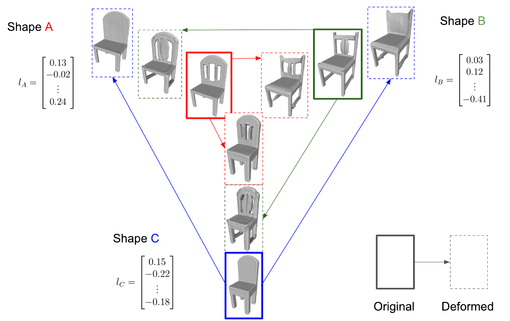
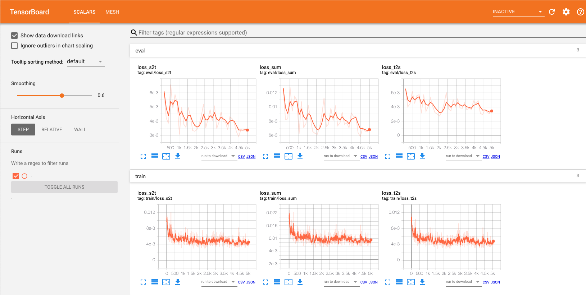
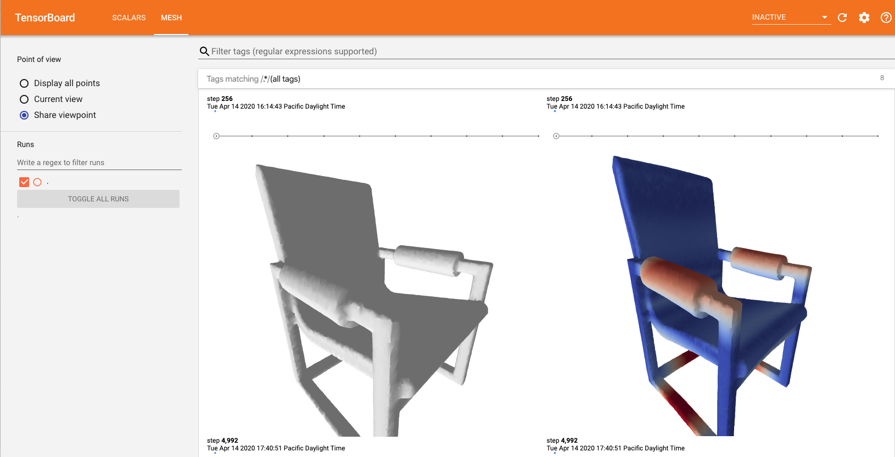

# ShapeFlow
Learnable Deformations Among 3D Shapes.
 
By: [Chiyu "Max" Jiang](http://maxjiang.ml/), [Jingwei Huang](http://stanford.edu/~jingweih/), [Andrea Tagliasacchi](http://gfx.uvic.ca/people/ataiya/), [Leonidas Guibas](https://geometry.stanford.edu/member/guibas/)

\[[Project Website]()\] \[[Paper]()\]
 


### Introduction
We present DeepDeform, a continuous flow model that allows the learning of a deformation space between geometries. We propose a novel flow-based learnable deformation framework for arbitary geometry pairs that is pairwise bijective, allowing a fast and high quality between objects. Furthermore, end-to-end training with a geometry encoder such as PointNet allows us to efficiently learn a deformation-aware shape embedding where the Euclidean distance between shapes in the embedding space directly correlates with the geometric differences between shapes. Such a learned deformation space allows us to perform "reconstruction via deformation", where we can seamlessly retrieve and deform geometries in a training set to match observations, that produces significantly better quality than comparable methods, and orders of magnitude faster.

### Installing dependencies
We recommend using pip to install all required dependencies with ease.
```
pip install -r requirements.txt
```

### Optional dependency (rendering)
We strongly suggest installing the optional dependencies for rendering meshes, so that you can visualize the results using interactive notebooks.
`pyrender` can be installed via pip:
```
pip install pyrender
```

Additionally to run the notebook renderings on a headless server, follow the [instructions](https://pyrender.readthedocs.io/en/latest/install/#python-installation) for installing `OSMesa`.

### Download and unpack data
To download and unpack the data used in the experiment, please use the utility script privided.
```
bash download_data.sh
```

### Run experiments
Please use our provided launch script to start training the shape deformation model.
```
bash shapenet_train.sh
```

The training will launch on all available GPUs. Mask GPUs accordingly if you want to use only a subset of all GPUs. The initial tests are done on NVIDIA Volta V100 GPUs, therefore the `batch_size_per_gpu=16` might need to be adjusted accordingly for GPUs with smaller or larger memory limits if the out of memory error is triggered.

### Load and visualize pretrained checkpoint
First download the pretrained checkpoint.
```
wget island.me.berkeley.edu/files/pretrained_ckpt.zip
mkdir -p runs
mv pretrained_ckpt.zip runs
cd runs; unzip pretrained_ckpt.zip; rm pretrained_ckpt.zip; cd ..
```

Next, run through the cells in `visualize_deformer.ipynb`.

### Monitor training
After launching the training script, a `runs` directory will be created, with different runs each as a separate subfolder within. To monitor the training process based on text logs, use
```
tail -f runs/<job_name>/log.txt
```

To monitor the training process using tensorboard, do:
```
# if you are running this on a remote server via ssh
ssh my_favorite_machine -L 6006:localhost:6006

# go to the directory containing the tensorboard log
cd path/to/DeepDeform/runs/<job_name>/tensorboard

# launch tensorboard
tensorboard --logdir . --port 6006
```
Tensorboard allows tracking of deformation losses, as well as visualizing the source / target / deformed meshes. The deformed meshes are colored by the distance per vertex with respect to target shape.




### Citation
If you find our code useful for your work, please consider citing our paper:
```
@inproceedings{
acoolpaper,
title={To be submitted},
author={Chiyu Max Jiang and Jingwei Huang and Andrea Tagliasacci and Leonidas Guibas},
booktitle={Maybe Neural Information Processing Systems 2020},
year={2020},
}
```

### Contact
Please contact [Max Jiang](mailto:maxjiang93@gmail.com) if you have further questions!
